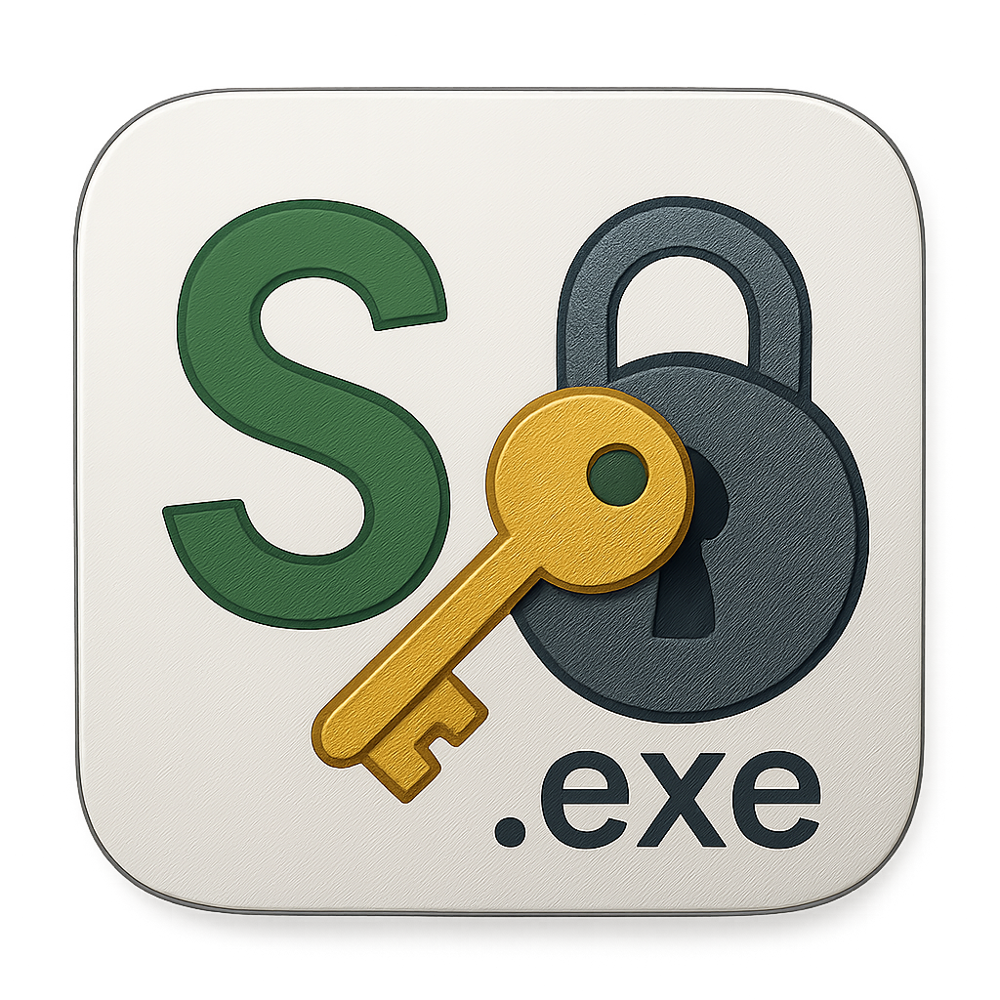

<p align="left">
  
</p>

###### The Cipher Toolkit Build For All Skill Levels 


# Command Line Interface (CLI)


## Windows
### MSYS2
Download [MSYS2](https://github.com/msys2/msys2-installer/releases/download/2024-12-08/msys2-x86_64-20241208.exe)
Install MSYS2 and run the following command:
````bash
pacman -Syu
````
```bash
pacman -Su
````
````bash
pacman -S base-devel mingw-w64-x86_64-toolchain git
````
   
#### MSYS2 MINGW64 Terminal
````bash
pacman -S mingw-w64-x86_64-gcc
````
```bash
pacman -S mingw-w64-x86_64-nlohmann-json
````
````bash
pacman -S mingw-w64-x86_64-gmp
````
````bash
pacman -S mingw-w64-x86_64-curl
````
````bash
pacman -S mingw-w64-x86_64-openssl
````
#### Clone 
```bash
git clone https://github.com/sokonalysis/sokonalysis.git
```
```bash
cd sokonalysis
````
````bash
cd src
````
#### Wordlist
````bash
curl -L -o wordlist.txt https://github.com/brannondorsey/naive-hashcat/releases/download/data/rockyou.txt
````
#### Crypto++
````bash
pacman -S --needed make git
````
````bash
git clone https://github.com/weidai11/cryptopp.git
````
````bash
cd cryptopp
````
````bash
make CXX=g++ -j$(nproc)
````
````bash
cd ..
````

### Build & Run
````bash
g++ -Icryptopp -std=c++17 *.cpp -lcryptopp -lssl -lcrypto -lcurl -lgmp -lgmpxx -o sokonalysis
````

````bash
./sokonalysis
````

   
## Linux   
### Clone
```bash
git clone https://github.com/sokonalysis/sokonalysis.git
```
```bash
cd sokonalysis
````
````bash
cd src
````

### Requirements
````bash
sudo apt update
````
````bash
sudo apt install libcrypto++-dev libcrypto++-doc libcrypto++-utils
````
````bash
sudo apt install libcrypto++-dev libssl-dev libcurl4-openssl-dev libgmp-dev libgmpxx4ldbl g++
````
````bash
sudo apt install libgmp-dev libmpfr-dev libmpc-dev
````
````bash
sudo apt install nlohmann-json3-dev
````

### Virtual Environment 
```bash
python3 -m venv pythonvenv
```
```bash
source pythonvenv/bin/activate
````
````bash
pip install -r requirements.txt
````

### Wordlist
````bash
curl -L -o wordlist.txt https://github.com/brannondorsey/naive-hashcat/releases/download/data/rockyou.txt
````

### Build & Run
````bash
g++ -I/usr/include/cryptopp -std=c++17 *.cpp -lcryptopp -lssl -lcrypto -lcurl -lgmp -lgmpxx -o sokonalysis
````
OR
````bash
g++ -Icryptopp -std=c++17 *.cpp -lcryptopp -lssl -lcrypto -lcurl -lgmp -lgmpxx -o sokonalysis
````
````bash
./sokonalysis
````


# Graphical User Interface (GUI)


#### Linux
````bash
wget https://github.com/sokonalysis/sokonalysis/releases/download/v3.5.0/sokonalysis_3.5.0_all.deb && sudo dpkg -i sokonalysis_3.5.0_all.deb
````
#### Execution 
````bash
sokonalysis
````


   


